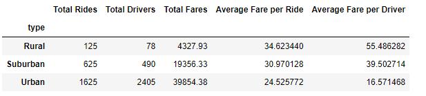
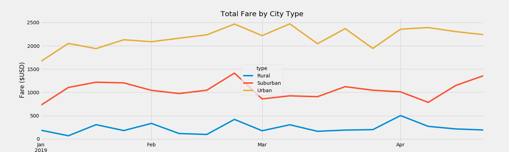

# PyBer_Analysis
Ride-sharing data was given and will get to what it can tell us.

## Overview of the analysis: 
The purpose of the new analysis is to create a summary of ride-sharing data by city type(Urban, Suburban, and Rural) using Pandas and Matplotlib. 
The report will include the mulitple-line graph at the end to show the total weekly fares for each city type.

## Results:  

This chart shows the differences in the ride-sharing datda among different city types. 
The interesting part was that in Rural, the total  number of rides and the total number of drivers were the least, but the average fare per driver and 
the average fare per ride were the highest. In Urban, the total number of rides and the total number of drivers were very much higher than the other 2 city types', which 
resulted in the total fares to be very high even though the average fare per ride and the average fare per driver were lower than others'.  

This multi-line graph is such an impacting graph because you can see right away that the total fare ($) in Urban was the highest and in Rural was the lowest. 
 

## Summary: Based on the results, provide three business recommendations to the CEO for addressing any disparities among the city types.
